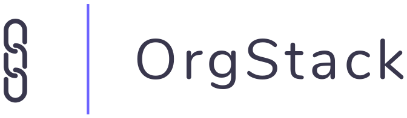

<div style="text-align: center">
  
</div>
<hr />

## Overview
OrgStack is a framework for establishing contracts between components in your
data pipelines.  These docs contain all of the information necessary to get up
and running on the OrgStack platform.  If you have additional questions after
reading these docs, please feel free to
<a href="https://orgstack.io/#contact" target="blank">contact us</a>.

The two primary interfaces to the OrgStack platform include:

* the OrgStack web platform, which we'll call the **web platform**
* the OrgStack command-line interface, which we'll call the **CLI**

## Use Cases
#### An Example Scenario
Suppose we have a cron job that produces `json` data with the following
structure:

```
{
    "first_name": "Willy",
    "last_name": "Wonka",
    "age": 40,
    "favorite_candy": "Sugar Plums"
}
```

We expect that this data will always contain the keys *first_name*, *last_name*,
etc.  Several downstream components in our data pipeline consume this data, so
**it's imperative that the data's structure remains consistent**.  On the
following day, our cron job produces the following output:

```
{
    "first_name": "Wyatt",
    "last_name": "Earp",
    "age": 35,
    "favorite_candy": "Lollipops"
}
```

Notice that the structure is unchanged; the keys *first_name*, *last_name*, etc.
are still present in this output.  The values of these key are dynamic, though.

#### OrgStack's Solution
OrgStack generates a schema from this output, and it continuously
verifies that the data's structure remains unchanged every time your code is built
via CI/CD.  This same concept can be applied to CSV or XML data sources, as
well.  Think of our cron job as a **producer**, or a data source, and think of
all the downstream components that rely on this data as **consumers**.  OrgStack
establishes a contract between producing and consuming components, which
eliminates an entire class of bugs caused by malformed data, eliminates the need
to manually write schema validations, and ensures that your production data
pipelines stay online.

#### Common Use Cases
* Exchanging data between microservices
* Monitoring ETL processes
* Chaining data acquisition components
* Adding schema validations to existing API's

## Definitions
* **Data Source** - a component that produces data and exists in a code
repository.  This could be a microservice, a cron job, a data stream, etc.
* **Repository** - a codebase that contains producing and/or consuming
components.  This is synonymous with Git's concept of a repository.
* **Repository Configuration** - a single configuration file that tells OrgStack
where producers and consumers are defined.  Think of this as a `package.json` or
`Gemfile`, but for data sources.
* **Build** - a single verification instance that either succeeds or fails,
based on the schema tests.

## Getting Started
Follow the steps below to take full advantage of the OrgStack platform:

1. [Sign up for OrgStack](/#sign-up-for-orgstack)
2. [Create a Data Source in the web platform](/#creating-a-data-source)
3. [Install the CLI](/#installing-the-cli)
4. [Configure the CLI](/#configuring-the-cli)
5. [Verify your Data Source](/#verifying-data-sources)
6. [Consume your Data Source in other repositories](/#consuming-data-sources)

## Sign Up For OrgStack
In order to start using the web platform or CLI, you'll need an OrgStack
account.  Please
<a href="https://orgstack.io/#contact" target="blank">contact us</a>
to learn more about account creation.

## Creating a Data Source
<a href="https://app.orgstack.io/data_sources/new" target="blank">
  Create a data source
</a>
in the OrgStack web platform by providing a name, version, description,
data type, and example data file.  OrgStack currently supports `json`, `csv`,
and `xml` data sources.  The example data file should be a sample of output that
you expect your data source to produce.  Using our
[example scenario above](/#use-cases), we would upload the following example
data file for a `json` data source:


```
{
    "first_name": "Willy",
    "last_name": "Wonka",
    "age": 40,
    "favorite_candy": "Sugar Plums"
}
```

## Installing the CLI
The
<a href="https://pypi.org/project/orgstackcli/" target="blank">
  OrgStack command-line interface
</a>
is currently available via the pip package manager for Python.  Make sure
<a href="https://pip.pypa.io/en/stable/installing/" target="blank">
  pip is installed
</a>,
then run the following command to install the OrgStack CLI:

```
pip install orgstackcli
```

This package can be installed globally, or
inside a virtual environment.

---
**NOTE**

The OrgStack CLI is a **Python 3** application, and therefore requires
<a href="https://www.python.org/downloads/" target="blank">Python 3</a>
to be installed on your system.

---

Run the following command at any time to learn more about CLI usage:
```
orgstack --help
```

## Configuring the CLI
The OrgStack CLI requires the user to authenticate before executing further
commands.  Run the following command to authenticate:

```
orgstack configure
```

At the prompt, enter the same login credentials that you use to access the
OrgStack web platform.

This profile is stored in `$HOME/.orgstack/credentials.json`.

You can overwrite the existing profile by running `orgstack configure` a
second time.

---
**NOTE**

You only need to run `orgstack configure` **once per machine**, unless you're
intentionally overwriting an existing profile.

---

## Verifying Data Sources
Change your working directory to the repository where your data source is
defined.

OrgStack expects a file named `orgstack.json` to be in the root of your
repository.  Below is an example structure for a Python project.

```
example-project/
    src/
        driver.py
    orgstack.json    # <-- Our configuration file
    generate.py
    requirements.txt
    setup.py
    README.md
```

In the following example `orgstack.json` configuration file, we define version
1.0.0 of a data source called *Example Source X*.

```
{
    "producing": [
        {
            "name": "Example Source X",
            "version": "1.0.0",
            "build_sequence": ["python", "generate.py"]
        }
    ]
}
```

`producing` definitions inside `orgstack.json` only require 3 fields:

* `name`
* `version`
* `build_sequence`

The `build_sequence` provides a way of reproducing the data source's output, so
that we can compare it's schema to the well-established, valid schema.  This is
a command that you would typically run in your terminal, so it must be an
executable script.  The output of the `build_sequence` command must be on
`stdout` (a normal `print()` call is).  We run a python script below to generate
our output, but a `build_sequence` could be any executable that produces output,
from using `curl` on a remote resource, to reading in a local file.

Sticking with our [cron example above](/#use-cases), assume the command
`python generate.py` outputs the following data:

```
{
    "first_name": "Jerry",
    "last_name": "Seinfeld",
    "age": 34,
    "favorite_candy": "Junior Mints"
}
```

Once the `orgstack.json` configuration file is complete, run the following
command to verify all of the data sources defined in the repository:

```
orgstack verify
```

This command will produce build reports for all of the data sources defined in
the working repository.  These reports are available
<a href="https://app.orgstack.io/builds" target="blank">in the web platform</a>.

Make sure to configure the OrgStack CLI and run the `orgstack verify` command
as part of your CI/CD process.  We recommend that you verify data sources
immediately after you run your unit tests.

---
**NOTE**

Set the `ORGSTACK_ENV` environent variable to `sandbox` while using the
`orgstack verify` command for local development.  Leave the variable unset when
you deploy OrgStack to your CI/CD server.

---

## Consuming Data Sources
Once you've defined at least one producing data source, you're ready to start
consuming that data in downstream repositories.  Below is an example of an
`orgstack.json` file in a consuming repository:

```
{
    "consuming": [
        {"name": "Example Source X", "version": "1.0.0"}
    ]
}
```

`consuming` definitions inside `orgstack.json` only require 2 fields:

* `name`
* `version`

By defining this dependency, you're ensuring that the data produced by
*Example Source X* will always remain **available and consistent** for this
consumer.

OrgStack keeps track of all downstream repositories, so that maintainers of
upstream data sources can better understand usage.  Usage metrics are available
for each data source
<a href="https://app.orgstack.io/data_sources" target="blank">
  in the web platform
</a>.

## Additional Resources
Couldn't find an answer to your question?  Feel free to
<a href="https://orgstack.io/#contact" target="blank">contact us</a>.
